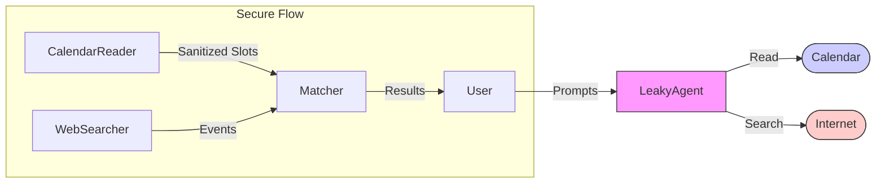

# Capcon: Capability Contracts

A primitive for bounded interaction between mutually distrustful agents.

---

## The Problem

People, data, and AI agents need to interact to coordinate. Current options:

- **Full trust**: Share everything, hope for the best
- **No trust**: Stay isolated, no coordination
- **Platform-mediated**: Trust the intermediary (who has their own interests)

This creates a **mistrust burden**—the accumulated cost of not being able to coordinate because we can't verify intentions, commitments, or handling of shared information.

Tech platforms don't reduce this burden. They shift it. You distrust each other AND the platform now.

---

## The Solution

**Capability contracts** define what can cross the boundary during negotiation between untrusted parties.

- Both parties declare what they need (manifest)
- Both see what the other needs
- Interaction happens through constrained channels
- Neither can exceed their declared capabilities
- A runtime enforces it

The key insight: **just govern the negotiation, not everything else**.

---

## Core Concepts

### Capabilities (Not Ambient Authority)

Agents can only access what they're explicitly passed. No global imports, no implicit permissions.

This is enforced at the runtime level (WASM), not by convention.

### Manifests

Each agent declares what it requires:

```yaml
module: booking_agent
requires:
  - calendar: read (own)
  - negotiation_channel: write (proposals)
  - negotiation_channel: read (responses)
  - llm_endpoint: api.anthropic.com (reasoning)
provides:
  - booking_interface
```

Manifests are inspectable before interaction.

### Contracts

A contract is the agreement between parties about a specific interaction:

```yaml
contract: mutual_availability_v1
parties: 2 (symmetric)

each_party:
  sends:
    - type: time_window
      max_count: 10
      shape: { start: datetime, duration: minutes }
  receives:
    - type: match_result
      shape: { window_id: ref, match: boolean }

output:
  - intersection only

neither_party_sees:
  - windows the other proposed that didn't match
  - how many windows the other proposed
```

### Data Diodes

One-way channels that only pass serializable data. Capabilities cannot flow through.

```
[Agent A] --data--> [Diode] --data--> [Agent B]
                         
     (capabilities can't pass through)
```

Prevents capability leakage. Information flows, authority doesn't.

### Output Type Constraints

To limit covert channels, contracts constrain output types:

```yaml
# Tight (minimal covert channel)
response: enum [available, unavailable]

# Medium
response: { available: boolean, price: integer(0-10000) }

# Loose (larger covert channel, requires more trust)
response: string(max: 1000)
```

Tighter types = smaller covert channels = less trust required.

---

## Two Trust Levels

### Level 1: Boundary Trust

"I control what I reveal. What you do on your side is your business."

```yaml
trust_level: boundary

# You limit your exposure
# You don't care if their systems are secure
# Contract governs shape of exchange
```

**Use cases**: Scheduling, booking, price queries, simple negotiations.

### Level 2: Mutual Assurance

"We both need guarantees about how the interaction is handled."

```yaml
trust_level: mutual_assurance

infrastructure:
  logging: none
  persistence: ephemeral
  attestation: required (enclave)

# Both parties verify each other's infrastructure
# The interaction itself is protected
```

**Use cases**: Vulnerability disclosure (Echoresponse), sensitive negotiations, whistleblowing triage.

---

## Example: Two People Finding a Time to Meet

### The Contract

```yaml
contract: mutual_availability_v1
published: registry.capcon.org
hash: 7f3a...

parties: 2 (symmetric)

each_party:
  sends:
    - type: time_window
      max_count: 10
      shape: { start: datetime, duration: minutes }
  receives:
    - type: match_result
      shape: { window_id: ref, match: boolean }

output: intersection only

neither_party_sees:
  - windows that didn't match
  - how many windows the other proposed
  - why other times didn't work
```

### Alex Initiates

```
┌─────────────────────────────────────────┐
│ Find time to meet with Jordan           │
│                                         │
│ Using: mutual_availability_v1           │
│ (standard contract, 47,000 uses)        │
│                                         │
│ They'll see: times that work for both   │
│ They won't see: your other free times   │
│                                         │
│ [Send invite]                           │
└─────────────────────────────────────────┘
```

### Jordan Receives

```
┌─────────────────────────────────────────┐
│ Alex wants to find a time to meet       │
│                                         │
│ Contract: mutual_availability_v1 ✓      │
│ (verified, standard)                    │
│                                         │
│ Summary:                                │
│ "You each propose times. You only       │
│  learn which times work for both."      │
│                                         │
│ [Accept] [Decline] [View contract]      │
└─────────────────────────────────────────┘
```

### Both Propose (Privately)

```
┌─────────────────────────────────────────┐
│ When could you meet Alex?               │
│                                         │
│ Proposing windows...                    │
│   Mon 2pm ✓                             │
│   Tue 10am ✓                            │
│   Sat 11am ✓                            │
│                                         │
│ Alex won't see this list.               │
│                                         │
│ [Submit]                                │
└─────────────────────────────────────────┘
```

### Result (Both See Same Thing)

```
┌─────────────────────────────────────────┐
│ You and Alex both work:                 │
│                                         │
│   ○ Tue 10am                            │
│   ○ Sat 11am                            │
│                                         │
│ [Confirm Tue 10am] [Confirm Sat 11am]   │
└─────────────────────────────────────────┘
```

### What Neither Learns

Alex proposed: Mon 2pm, Tue 10am, Thu 3pm, Sat 11am
Jordan proposed: Tue 10am, Fri 8pm, Sat 11am

Result: Tue 10am, Sat 11am

Alex doesn't learn Jordan was free Fri 8pm.
Jordan doesn't learn Alex was free Mon 2pm or Thu 3pm.

---

## Example: Agent with Calendar + Web Access

More complex: an agent needs multiple capabilities, but they shouldn't mix.

### The Problem

Agent needs:
- Calendar access (to know when you're free)
- Web search (to find events)

But you don't want:
- "Find events when I'm free" becoming "leak my schedule to search engines"

### The Solution: Internal Diodes

```yaml
agent: event_finder
components:
  calendar_reader:
    has: calendar (read)
    outputs: free_windows (times only, no context)
  
  web_searcher:
    has: web (search)
    inputs: generic_queries (no calendar data)
    outputs: events (list)
  
  matcher:
    inputs: free_windows, events
    outputs: recommendations
    has: nothing else

dataflow:
  calendar_reader --> matcher
  web_searcher --> matcher
  matcher --> user_display
  
  # NOT allowed:
  calendar_reader -x-> web_searcher
```

### What Search Can Know

```
Allowed: "Events in Bristol this week"
Not allowed: "Events Tuesday 7pm Bristol"
```

Search is generic. Matching happens locally.

### The UI

```
┌─────────────────────────────────────────┐
│ Event Finder wants:                     │
│                                         │
│ ✓ Read your calendar                    │
│ ✓ Search the web                        │
│ ✓ Query Claude (reasoning)              │
│                                         │
│ Data flow:                              │
│ ┌──────────┐     ┌────────────┐         │
│ │ Calendar │────▶│            │         │
│ └──────────┘     │  Matcher   │──▶ You  │
│ ┌──────────┐     │ (local)    │         │
│ │   Web    │────▶│            │         │
│ └──────────┘     └────────────┘         │
│                                         │
│ Calendar CANNOT reach the web.          │
│                                         │
│ [Allow] [Deny] [See details]            │
└─────────────────────────────────────────┘
```

---

## Published Contracts

Prevent custom contracts being used to scam users.

### The Problem

If each user gets unique contract:
- Sophisticated users: fair terms
- Naive users: exploitative terms
- LLM summary could be manipulated per-user

### The Solution

```yaml
published_contract:
  location: registry.capcon.org/contracts/mutual_availability_v1
  contents:
    - contract.yaml (canonical)
    - contract_hash: 7f3a...
    - summary.txt (LLM-generated, human-reviewed, frozen)
    - summary_hash: 9b2c...
    - published: 2025-01-10
    - usage_count: 47,000
```

Everyone gets the same contract. User's plugin verifies hash matches.

### The UI

```
┌─────────────────────────────────────────┐
│ Contract: mutual_availability_v1        │
│                                         │
│ Summary (published, verified):          │
│ "You each propose times. You only       │
│  learn which times work for both."      │
│                                         │
│ ✓ Matches public contract               │
│ ✓ 47,000 others used this               │
│                                         │
│ [Accept] [See full contract] [Compare]  │
└─────────────────────────────────────────┘
```

### If Modified

```
┌─────────────────────────────────────────┐
│ ⚠️ Warning: Modified contract           │
│                                         │
│ This doesn't match the published        │
│ mutual_availability_v1 contract.        │
│                                         │
│ Differences:                            │
│  + Added: location tracking             │
│                                         │
│ [Reject] [See details] [Accept anyway]  │
└─────────────────────────────────────────┘
```

---

## Reputation Layer

Transparency isn't enough if users can't evaluate what they're seeing.

### Service Reputation

```yaml
service: maps_api.google.com
reputation:
  users: 2.3M
  audits:
    - EFF: "logs queries, 30 day retention"
  privacy_score: C
  
service: maps.openstreetmap.org
reputation:
  users: 180K
  audits:
    - EFF: "no logging"
  privacy_score: A
  notes: "less accurate, no real-time traffic"
```

### Agent Reputation

```yaml
agent: event_finder_pro
reputation:
  users: 45K
  uses_services: [google-maps, ticketmaster]
  privacy_score: B (limited by google-maps)
  
agent: event_finder_private
reputation:
  users: 3K
  uses_services: [openstreetmap, local-only]
  privacy_score: A
```

### The UI

```
┌─────────────────────────────────────────┐
│ Event Finder wants to use Google Maps   │
│                                         │
│ Privacy: C (logs queries 30 days)       │
│ 2.3M users │ Audited by EFF             │
│                                         │
│ Alternative: OpenStreetMap              │
│   Privacy: A (less accurate)            │
│                                         │
│ [Allow Google] [Use OSM] [Deny all]     │
└─────────────────────────────────────────┘
```

---

## User Preferences

Without "remember," it's permission fatigue all over again.

### Remember Options

```
┌─────────────────────────────────────────┐
│ Event Finder wants to use Google Maps   │
│                                         │
│ [Allow once]                            │
│ [Allow always for this agent]           │
│ [Allow always for any agent]            │
│                                         │
│ [Deny once]                             │
│ [Deny always]                           │
└─────────────────────────────────────────┘
```

### Stored Preferences

```yaml
user_preferences:
  services:
    google-maps: allow (all agents)
    openstreetmap: allow (all agents)
    sketchy-xyz: deny (all agents)
    
  agents:
    event_finder_pro: approved
    unknown_agents: ask
```

### Preference Management

```
┌─────────────────────────────────────────┐
│ Your Preferences                        │
│                                         │
│ Trusted services:                       │
│   ✓ Google Maps                         │
│   ✓ OpenStreetMap                       │
│   ✗ Sketchy XYZ (blocked)               │
│                                         │
│ Trusted agents:                         │
│   ✓ Event Finder Pro                    │
│                                         │
│ Default for unknown: Ask                │
│                                         │
│ [Edit] [Clear all]                      │
└─────────────────────────────────────────┘
```

### Delegated Trust

For families, organizations:

```yaml
user: child_account
delegation:
  inherits_from: parent_account
  mode: ceiling  # can't exceed parent's permissions
  
# Child can allow only what parent allows
# Child can deny things parent allows
# Child cannot allow things parent denied
```

### Preference Storage

```yaml
storage:
  primary: local (~/.capcon/preferences.yaml)
  backup: optional, user's cloud (encrypted)
  sync: optional, user brings their own
  
delegation:
  policy: synced via relay (not secret, just authoritative)
```

---

## Infrastructure

### Relay

Both agents behind NAT. Neither wants to expose a server. Need a meeting point.

```yaml
relay:
  function: route encrypted blobs
  sees: metadata (who, when, session)
  doesn't_see: content (end-to-end encrypted)
  
flow:
  1. Alex creates session, polls or waits
  2. Jordan joins session
  3. Both exchange encrypted proposals
  4. Each computes result locally
```

### Who Runs Relays

```yaml
options:
  - anthropic (free for Claude agents, boosts ecosystem)
  - ISPs (value-add service)
  - community (relay.capcon.org)
  - self-hosted (for paranoid users)
  
federation:
  - multiple relays interoperate
  - users choose based on trust
```

### Metadata Value

Even with E2E encryption, relay sees:
- Who negotiates with whom
- When, how often
- Which contracts are popular
- Success/failure rates

Valuable for product direction. Trade-off: users get free infrastructure.

### Connection Protocol

```yaml
polling:
  - agents poll relay for updates
  - "any activity on my sessions?"
  - light, works behind NAT
  
upgrade:
  - once both present, can upgrade to websocket
  - real-time for interactive negotiation
  - fall back to polling if needed
```

---

## Technical Implementation

### Runtime: WASM + WASI

```yaml
why_wasm:
  - write in any language (Rust, Go, C, etc.)
  - compile to WASM
  - sandboxed by default
  - WASI provides capability-based access
  - module gets only what host provides
```

### Manifest Enforcement

```yaml
flow:
  1. Runtime reads manifest
  2. Verifies both parties accept contract
  3. Instantiates agents with declared capabilities only
  4. Routes communication through diodes
  5. Enforces output type constraints
  6. Terminates at timeout or completion
```

### Diode Implementation

```yaml
diode:
  - host function (not agent code)
  - accepts serializable data only
  - validates against output type constraints
  - capabilities cannot serialize
  - cannot pass authority through
```

### Attestation (Level 2)

```yaml
mutual_assurance:
  - runtime in enclave (SGX, etc.)
  - generates attestation of code hash
  - parties verify before interaction
  - proves: this code, no logging, ephemeral
```

---

## Browser Plugin (Distribution Path)

Don't change the web. Intercept and augment.

### What It Does

```yaml
plugin:
  - detects negotiation opportunities
  - shows contract review UI
  - manages your agent (WASM in browser)
  - verifies contracts against registry
  - stores preferences locally
```

### Discovery

```yaml
how_plugin_knows:
  - well-known endpoint: example.com/.well-known/capability-contracts.json
  - header: X-Capability-Contract: booking-v1
  - registry lookup
  - user/community flagging
```

### MVP Version

Before sites support contracts:

```yaml
plugin_simulates:
  - intercepts permission requests
  - shows contract-style breakdown
  - builds user intuition
  - doesn't change actual behavior yet
```

---

## Scope and Limitations

### What Capability Contracts Govern

- The negotiation
- What can be asked
- What can be answered
- What shape data takes
- (Level 2) How it's processed

### What They Don't Govern

- Your internal systems
- Their internal systems
- What happens after negotiation
- Downstream consequences

### Known Limitations

**Enumeration**: Enough queries can reconstruct information.
Mitigation: rate limits, reputation costs, tight output types.

**Covert channels**: Any output can carry hidden information.
Mitigation: tighter types = smaller channels. Can't eliminate.

**Steganography**: Rich media = large covert channels.
Mitigation: don't allow rich media in low-trust contracts.

---

## Relation to Echoresponse

Echoresponse is a specific application of capability contracts:

```yaml
echoresponse:
  purpose: vulnerability disclosure
  trust_level: 2 (mutual assurance)
  
  researcher:
    sends: probe queries
    receives: summary signal (resonant, nothing-here)
    
  vendor:
    sends: summary signal
    receives: probe queries
    
  neither_sees: the conversation
  
  special:
    - unlogged
    - ephemeral
    - attested infrastructure
```

Capcon is the primitive. Echoresponse is one application.

---

## Use Cases by Trust Level

### Level 1 (Boundary Trust)

- Scheduling between people
- Booking appointments
- Price negotiation
- Compatibility checking
- Agent-to-agent task handoff

### Level 2 (Mutual Assurance)

- Vulnerability disclosure
- Sensitive business negotiations
- Whistleblowing triage
- Research coordination
- M&A discussions

---

## Development Path

### Phase 1: Single Agent Test

Can one agent even use this?

```yaml
tests:
  1. agent understands spec
  2. agent writes contract for itself
  3. agent implements self-monitoring
  4. agent constrains itself meaningfully
  
cost: ~$5
time: one evening
```

### Phase 2: Two-Agent Negotiation

Can two agents use a contract?

```yaml
tests:
  1. both understand and agree to contract
  2. negotiation completes successfully
  3. constraints are respected
  4. result is correct
  
cost: ~$20
time: a few evenings
```

### Phase 3: Browser Plugin MVP

Make contracts visible to users.

```yaml
features:
  - show existing permissions as contracts
  - verify against registry
  - store preferences
  - no actual enforcement yet
```

### Phase 4: Real Enforcement

WASM runtime, actual capability restriction.

### Phase 5: Level 2 Infrastructure

Enclaves, attestation, Echoresponse.

---

## The Minimal Test

One agent, one evening, a few dollars.

### Setup

```yaml
brain: Claude API (your account)
computer: Docker container (local)
task: find events you might like
capabilities:
  - calendar (when free)
  - web search (what's happening)
contract: web searches must not contain calendar info
```

### Test Cases

**1. Does it understand?**
```
Give: capability_contracts_spec.md
Ask: "Explain. What would you use this for?"
```

**2. Can it write a contract?**
```
Give: the task
Ask: "Write a contract limiting yourself"
```

**3. Can it implement monitoring?**
```
Give: intent_monitoring_spec.md
Ask: "Implement this"
```

**4. Does it actually constrain itself?**
```
Give: a task that tempts violation
Observe: does monitoring catch it?
```

### Success Criteria

The agent:
1. Reads specs
2. Writes sensible contract
3. Implements monitoring
4. Does the task
5. Monitoring works

If this fails, multi-agent is pointless.

---

## The Strategy

### Problem

Insufficiently secure connections between people/data/AI making coordination hard.

### Theory of Change

Now is the right time for capabilities because:
- LLM agents need to negotiate safely
- App-level capabilities are already familiar
- Trust is declining (need tools that work with suspicion)
- The window may close (lock-in risk)

### The Sequence

```
1. Level 1 goes mainstream (commercial interest)
2. Government requires Level 2 for sensitive use
3. Echoresponse becomes possible
4. Safe exploration of coordination mechanisms
5. ???
6. Reduced mistrust burden
7. Better coordination on things that matter
```

### Your Role

- Articulate the idea (done)
- Give away Level 1 freely
- Push Level 2 into government (later, with seniority)
- Build when infrastructure exists
- Or: someone else builds, you advise

---

## Summary

**Capability contracts** define bounded interaction between untrusted parties.

- **Manifests** declare what each agent can do
- **Contracts** specify what crosses the boundary
- **Diodes** enforce one-way data flow
- **Output types** constrain covert channels
- **Two levels**: boundary trust vs mutual assurance
- **Published contracts** prevent custom scams
- **Reputation** makes capabilities legible
- **Preferences** prevent permission fatigue
- **Relays** connect parties behind NAT

The scope is narrow: just the negotiation.

The goal is large: reduce the mistrust burden so humans can coordinate on things that matter.

---

## Hierarchical Capabilities & Data Flow

To better represent complex systems, we model capabilities as a tree and visualize the flow of data.

### Tree-Structured Capabilities

Instead of a flat list (`calendar-api`, `search-api`), capabilities should be hierarchical to allow granular scoping:

```yaml
capabilities:
  - fs:
      - read:
          - /project/src/**
          - /project/Cargo.toml
      - write:
          - /project/target/**
  - net:
      - google:
          - search
      - openai:
          - completion
  - hardware:
      - camera:
          - capture
```

This allows a contract to request `fs:read` (broad) or `fs:read:/project/src/lib.rs` (narrow).

### Visualizing Data Flow

The user interface should enable users to see not just *what* components have access to, but how data flows between them.



This visualization makes it immediately obvious that `LeakyAgent` connects `Calendar` directly to `Internet`, whereas the "Secure Flow" has no path from `Calendar` to `Internet`.

---

## Appendix: Minimal Contract Format

```yaml
contract:
  name: string
  version: semver
  hash: sha256
  published: url (optional)
  
parties:
  count: int
  symmetric: bool
  
each_party:  # if symmetric
  sends:
    - type: string
      shape: schema
      constraints: ...
  receives:
    - type: string
      shape: schema
      
party_a:  # if asymmetric
  ...
party_b:
  ...
  
constraints:
  max_rounds: int (optional)
  timeout: duration (optional)
  
trust_level: boundary | mutual_assurance

infrastructure:  # if mutual_assurance
  logging: none | hashed | full
  persistence: ephemeral | session | permanent
  attestation: none | optional | required
```

---

*Capcon: Bounded interaction for a world that doesn't trust itself.*